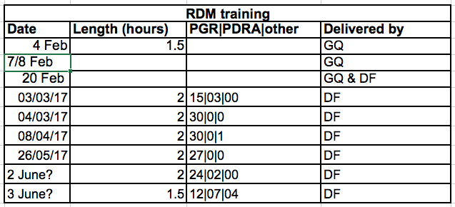
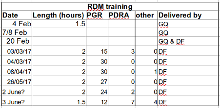
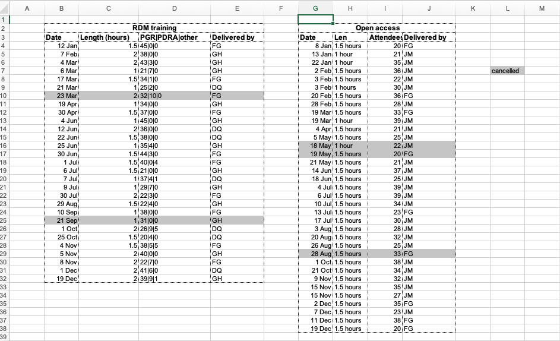
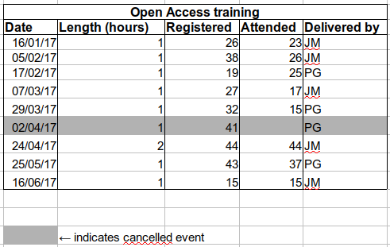
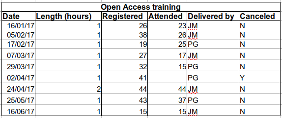

> ## About this episode 
> We organize data in spreadsheets in the ways that we as humans want to work with the data, but computers require that data is organized in particular ways. In order to use tools that make computation more efficient, we need to structure our data the way that computers need the data. This episode will cover:
>
> 1. TOC
> {:toc}
> {: .toc}
{: .callout .toc}

## Good practices for structuring data tables
The most common mistake made is treating the spreadsheet program like it is a notebook by relying on context, notes in the margin, spatial layout of data and fields to convey information.
As humans,
we can (usually) interpret these things,
but computers are unintelligent,
and unless we explain to the computer what every single thing means
(and that can be hard!)
it will not be able to see how our data fit together.

Using the power of computers,
we can manage and analyze data in much more effective and faster ways,
but to use that power,
we have to set up our data for the computer to be able to understand it
(and computers are very literal).

This is why it’s extremely important to set up well-formatted tables from the outset **before** you even start collecting data to analyse.
**Data organization is the foundation of your data-related work.**
Unorganized data can make it harder to work with your data,
so you should be mindful of your data organization when doing your data entry.
You'll want to organize your data in a way that allows other programs and people to easily understand and use the data.

**Note:** The best layouts/formats (as well as software and
interfaces) for **data entry** and **data analysis** might be
different. It is important to take this into account, and ideally
automate the conversion from one to another.

### Keeping track of your analyses

When working with spreadsheets during data clean up or analyses, it's
very easy to end up with a spreadsheet that looks very different from the one
you started with. In order to be able to reproduce your analyses or figure out
what you did when your leadership team asks for a different analysis,
you **must:**

- **create a new file or tab with your cleaned or analyzed data.** Do
  not modify the original dataset, or you will never know where you
  started!
- **keep track of the steps you took in your clean up or analysis.**
  You should track these steps as a scientist would each step in an
  experiment. You can do this in another text file, or a good option
  is to create a new tab in your spreadsheet with your notes. This way
  the notes and data stay together.

This might be an example of a spreadsheet setup:

We will put these principles into practice today during your exercises.

## How to structure data tables in spreadsheets

The cardinal rules of using spreadsheet programs for data:

1. Put all your **variables in columns** - the thing you're measuring,
   like 'length' or 'attendance'.
2. Put each **observation in its own row**.
3. **Don't combine multiple pieces of information in one
   cell**. Sometimes it just seems like one thing, but think if that's
   the only way you'll want to be able to use or sort that data.
4. **Leave the original (raw) data raw** - don't mess with it!
5. Export the cleaned data to a **text based format** like CSV. This
   ensures that anyone can use the data, and is the format required by
   most data repositories.

For instance, we have data from attendance and instruction for previous
research data management workshops. Different people have entered data in to a
spreadsheet. They keep track of things like date, number of attendees, and who
delivered the workshop.

If they were to keep track of the data like this:

the problem is that the number of attendees of different types (post-graduate
researcher (PGR), post-doctoral research associate (PDRA), and other) are in
the same field. So if they wanted to look at attendance by post-graduate
researchers, it would be hard to set up the data to do this. If instead we
put attendee categories in different columns, you can see that it would be much
easier.

### Columns for variables and rows for observations

The rule of thumb, when setting up a datasheet, is **columns =
variables**, **rows = observations**, **cells = data** (values).

So, instead we should have:

> ### Exercise
>
> We're going to take a messy version of some data and clean it up.
> (Remember to **create a new file** for the cleaned data, and **never
> modify the original (raw) data**.)
>
> 1. First [download the data](../data/training_attendance.xlsx)
> 1. Open up the data in a spreadsheet program.
> 1. You can see that there are three tabs. Various people have recorded
  training attendance statistics over 2016 and 2017, and they have
  kept track of the data in their own way. Now you're being asked to
  evaluate the training programme and you want to be able to start
  doing statistics with the data.
> 1. With the person next to you, work on the messy data so that a
  computer will be able to understand it. Clean up the 2016 and 2017
  tabs, and put them all together in one spreadsheet.
> 1. What do you think was wrong with this data and how did you fix it?
{: .challenge}

## How to address common issues with spreadsheet software

> ### Discussion
>
> What was wrong with the data in the previous exercise and how did you fix it?
>
>> ### Examples from the section below
>> - [Multiple tables](#tables)
>> - [Multiple tabs](#tabs)
>> - [Not filling in zeros](#zeros)
>> - [Using bad null values](#null)
>> - [Using formatting to convey information](#formatting)
>> - [Using formatting to make the data sheet look pretty](#formatting_pretty)
>> - [Placing comments or units in cells](#units)
>> - [More than one piece of information in a cell](#info)
>> - [Field name problems](#field_name)
>> - [Special characters in data](#special)
>> - [Inclusion of metadata in data table](#metadata)
>> - [Using software specific date formats](#dates)
> {: .solution}
{: .discussion}

### Multiple tables {#tables}

A common strategy is creating multiple data tables within one
spreadsheet. **This confuses the computer, so don't do this!** When
you create multiple tables within one spreadsheet, you’re drawing
false associations between things for the computer, which sees each
row as an observation. You’re also potentially using the same field
name in multiple places, which will make it harder to clean your data
up into a usable form. The example below depicts the problem:

### Multiple tabs {#tabs}

But what about worksheet tabs? That seems like an easy way to organize data, right? Well, yes and no. When you create extra tabs, you fail to allow the computer to see connections in the data that are there (you have to introduce spreadsheet application-specific functions or scripting to ensure this connection). Say, for instance, you make a separate tab for each year.

This is bad practice for two reasons:
**1)** you are more likely to accidentally add inconsistencies to your data if each time you take a measurement, you start recording data in a new tab, and
**2)** even if you manage to prevent all inconsistencies from creeping in, you will add an extra step for yourself before you analyze the data because you will have to combine these data into a single data table. You will have to explicitly tell the computer how to combine tabs - and if the tabs are inconsistently formatted, you might even have to do it by hand!

The next time you’re entering data, and you go to create another tab or table, I want you to ask yourself “Self, could I avoid adding this tab by adding another column to my original spreadsheet?”

Your data sheet might get very long over the course of recording data. This makes it harder to enter data if you can’t see your headers at the top of the spreadsheet. But do NOT repeat headers. These can easily get mixed into the data, leading to problems down the road.

Instead you can Freeze the column headers.

[Documentation on how to freeze column headers in Microsoft Excel](https://support.office.com/en-ca/article/Freeze-column-headings-for-easy-scrolling-57ccce0c-cf85-4725-9579-c5d13106ca6a)

[Documentation on how to freeze column headers in LibreOffice Calc](https://help.libreoffice.org/Calc/Freezing_Rows_or_Columns_as_Headers)

### Not filling in zeroes {#zeros}

It might be that when you're measuring something, it's
usually a zero, say the number of participants at a training event. Why bother
writing in the number zero in that column, when it's mostly zeros?

However, there's a difference between a zero and a blank cell in a spreadsheet. To the computer, a zero is actually data. You measured or counted it. A blank cell means that it wasn't measured and the computer will interpret it as a null value.

The spreadsheets or statistical programs will likely mis-interpret blank cells that are meant to be zero. This is equivalent to leaving out data. Zero observations are real data! Leaving zero data blank is not good in a written format, but NEVER okay when you move your data into a digital format.

### Using bad null values {#null}

**Example**: using -999 or other numerical values (or zero).

**Solution**: Many statistical programs will not recognize that numeric values of null are indeed null. It will depend on the final application of your data and how you intend to analyse it, but it is essential to use a clearly defined and CONSISTENT null indicator. Blanks (most applications) and NA (for R) are good choices.

From White et al, 2013, [Nine simple ways to make it easier to (re)use your data.](https://ojs.library.queensu.ca/index.php/IEE/article/view/4608) Ideas in Ecology and Evolution:

### Using formatting to convey information  {#formatting}

**Example**: highlighting cells, rows or columns that should be excluded from an analysis, leaving blank rows to indicate separations in data.

**Solution**: create a new field to encode which data should be excluded.

### Using formatting to make the data sheet look pretty {#formatting_pretty}

**Example**: merging cells.

**Solution**: If you’re not careful, formatting a worksheet to be more aesthetically pleasing can compromise your computer’s ability to see associations in the data. Merged cells are an absolute formatting NO-NO if you want to make your data readable by statistics software. Consider restructuring your data in such a way that you will not need to merge cells to organize your data.

### Placing comments or units in cells {#units}

**Example**: Your data was collected, in part, by a summer student who you later found out was mis-recording the duration of training sessions, some of the time. You want a way to note these data are suspect.

**Solution**: Most statistical programs can’t see Excel’s comments, and would be confused by comments placed within your data cells. As described above for formatting, create another field if you need to add notes to cells. Similarly, don’t include units in cells (such as "hours","min"): ideally, all the units or measurements you place in one column should be of the same standard, but if for some reason they aren’t, insert another column and specify the units.

### More than one piece of information in a cell {#info}

**Example**: 
One table recorded attendance by the different types of attendees. This table recorded number of attendees of different types: post-graduate researcher (PGR), post-doctoral research associate (PDRA), and other. 

**Solution**: 
Never include more than one piece of information in a cell. Design your data sheet to include a column for each type of attendee, if this information is important to collect, rather than just a total number.

### Field name problems {#field_name}
Choose descriptive field names, but be careful not to include: spaces, numbers, or special characters of any kind. Spaces can be misinterpreted by parsers that use whitespace as delimiters and some programs don’t like field names that are text strings that start with numbers.
Underscores (`_`) are a good alternative to spaces and consider writing names in camel-case to improve readability. Remember that abbreviations that make sense at the moment may not be so obvious in 6 months but don't overdo it with names that are excessively long. Including the units in the field names avoids confusion and enables others to readily interpret your fields.

**Examples**  

| Good Name          | Good Alternative   | Avoid                |
|--------------------+--------------------+----------------------|
| Max\_temp\_C       | MaxTemp            | Maximum Temp (°C)    |
| Precipitation\_mm  | Precipitation      | precmm               |
| Mean\_year\_growth | MeanYearGrowth     | Mean growth/year	 |
| sex                | sex                | M/F                  |
| length             | length             | l                   |
| cell\_type         | CellType           | Cell Type            |
| Observation\_01    | first\_observation | 1st Obs              |

### Special characters in data {#special}

**Example**: You treat Excel as a word processor when writing notes, even copying data directly from Word or other applications.

**Solution**: This is a common strategy. For example, when writing longer text in a cell, people often include line breaks, em-dashes, et al in their spreadsheet.  Worse yet, when copying data in from applications such as Word, formatting and fancy non-standard characters (such as left- and right-aligned quotation marks) are included.  When exporting this data into a coding/statistical environment or into a relational database, dangerous things may occur, such as lines being cut in half and encoding errors being thrown.

General best practice is to avoid adding characters such as newlines, tabs, and vertical tabs.  In other words, treat a text cell as if it were a simple web form that can only contain text and spaces.

### Inclusion of metadata in data table {#metadata}

**Example**: You add a legend at the top or bottom of your data table explaining column meaning, units, exceptions, etc.

**Solution**: While recording data about your data ("metadata") is essential, this information should not be contained in the data file itself. Unlike a table in a paper or a supplemental file, metadata (in the form of legends) should not be included in a data file since this information is not data, and including it can disrupt how computer programs interpret your data file. Rather, metadata should be stored as a separate file in the same directory as your data file, preferably in plain text format with a name that clearly associates it with your data file. Because metadata files are free text format, they also allow you to encode comments, units, information about how null values are encoded, etc. that are important to document but can disrupt the formatting of your data file.

### Date formats in spreadsheets {#dates}

**Example**: You enter a full date as the value in a column. 

**Solution**: Whilst this seems the most natural way to record dates and
Spreadsheet programs have numerous “useful features” which allow them to “handle” dates, it actually is not a good practice. 
A spreadsheet application will display the dates in
seemingly correct way (for the human eye) but how it actually handles
and stores the dates may be problematic. 

Excel **stores dates as a number** - see the last column in the above figure. Essentially, it counts the days from a default of December 31, 1899, and thus stores July 2, 2014 as  the serial number 41822.

It is safer to store dates with MONTH, DAY and YEAR in separate columns or as YEAR and DAY-OF-YEAR in separate columns.

> ### Further reading
> - [Hadley Wickham (2014) Tidy Data. In Journal of Statistical Software. Vol. 59, Issue 10.](http://www.jstatsoft.org/v59/i10)
> - [ELIXIR (2021) Metadata management. In Research Data Management Kit. A deliverable from the EU-funded ELIXIR-CONVERGE project (grant agreement 871075).](https://rdmkit.elixir-europe.org/metadata_management.html)
>
{: .callout}