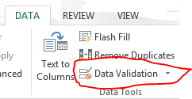
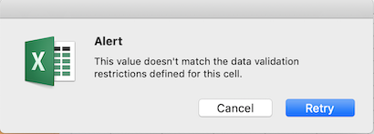
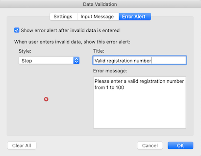

> ## About this episode 
> When you have a well-structured data table, you can use several simple techniques within your spreadsheet to ensure the data you enter is free of errors. These approaches include techniques that are implemented **prior to entering data** (**quality assurance**) and techniques that are used **after entering data to check for errors** (**quality control**).
> 1. TOC
> {:toc}
> {: .toc}
{: .callout .toc}

## Good practices for minimising errors in data entry
This section gives a summary of recommendations on minimising errors in survey data entry (UK Data Service, 2017a; ICPSR, 2012; Groves et al., 2004).

### Check the completeness of records
Check if your data files contain the correct number of records, number of variables or length of the records, etc.

### Reduce burden of manual data entry
Manual data entry requires routine and concentration. Operators should not be burdened by multiple tasks. Tasks such as coding and data entry should be implemented separately.

### Minimise the number of steps
The data entry process should include a smaller rather than a larger number of steps. This reduces the likelihood of errors.

### Conduct data entry twice
When you have paper questionnaires, the data entry can be processed electronically by scanning questionnaires or manually entering data by a person responsible for data entry. If data are entered by scanning, execute the process of data entry twice and compare values. If data are entered manually, a portion of questionnaires should be entered twice by two different persons. For example, the Czech Association of Public Opinion and Market Research Agencies (SIMAR) recommends 20 percent of questionnaires be re-entered.

### Perform in-depth checks for selected records
At least some randomly selected records, e.g. 5–10% of all records, should be subjected to a more detailed, in-depth check to verify the procedures and identify possible systematic errors. The cases should be selected by chance. Be sure to document the changes you make and keep the original data so you can restore them at all times.

### Perform logical and consistency checks
There are multiple methods for logical and consistency checks, including the following:
-  Check the value range (e.g. a respondent over the age of 100 is unlikely);
-  Check the lowest and highest values and extremes;
-  Check the relations between associated variables (e.g. educational attainment should correspond with a minimum age, the total number of hours spent doing various activities should not exceed 100% of the available time);
-  Compare your data with historical data (e.g. check the number of household members with the previous wave of a panel survey).

### Automate checks whenever possible
Specialised software for computer-assisted interviewing (CAPI, CATI, etc.) or data entry software allows to set the range of valid values for each category and to apply filters to manage the data entry or the entire data collection process. These automatic checks:

- Prevent meaningless values from being entered;
- Help to discover inconsistencies that arise when some values are skipped or omitted;
- Make the interviewer's work substantially clearer and easier;
- Reduce the number of errors that interviewers make.

The software can distinguish between permanent rules that cannot be bent and warnings that only notify the operator when entering an unlikely value.

## How to enforce data entry validation

Quality assurance stops bad data from ever being entered by checking to see if
values are valid during data entry. For example, if research is being conducted
at sites A, B, and C, then the value V (which is right next to B on the
keyboard) should never be entered. Likewise if one of the kinds of data being
collected is a count, only integers greater than or equal to zero should be
allowed.

To control the kind of data entered into a a spreadsheet we use Data Validation
(Excel) or Validity (LibreOffice Calc), to set the values that can be entered
in each data column.

1. Select the cells or column you want to validate

2. On the `Data` tab select `Data Validation`

   

3. In the `Allow` box select the kind of data that should be in the
   column. Options include whole numbers, decimals, lists of items, dates, and
   other values.

   

4. After selecting an item enter any additional details. For example if you've
   chosen a list of values then enter a comma-delimited list of allowable
   values in the `Source` box.

We can't have half a person attending a workshop, so let's try this
out by setting the `num_registered` column in our spreadsheet to only
allow whole numbers between 1 and 100.

1. Select the `num_registered` column
2. On the `Data` tab select `Data Validation`
3. In the `Allow` box select `Whole number`
4. Set the minimum and maximum values to 1 and 100.

Now let's try entering a new value in the `num_registered` column that isn't a valid class size. The spreadsheet stops us from entering the wrong value and asks us if we would like to try again.

You can customize the resulting message to be more informative by entering
your own message in the `Error Alert` tab, and you can edit the `Style`
for when a non-valid value is entered, by not allowing other values or just give a warning about non valid entries. 

To display a (pop up) message about the correct values for a column with Data Validation set, use the `Input Message` tab.

Quality assurance can make data entry easier as well as more robust. For
example, if you use a list of options to restrict data entry, the spreadsheet
will provide you with a drop-downlist of the available items. So, instead of
trying to remember the workshop title abbreviation, you can just select the
right option from the list.

> ### Exercise
>
> Given the following partial data dictionary:
>
> | Variable name | ENA Variable name | Measurement unit | Allowed values | Definition | Description |
> |-|-|-|-|-|-|
> | strain | strain |  | NCIT ontology:  C56BL/6 Mouse (NCIT:C14424),  BALB/cJ Mouse (NCIT:C14657) | The mouse strain of the animal |  |
> | developmental stage | dev_stage |  | BTO ontology:  pup (BTO:0004377),  adult (BTO:0001043),  embryo (BTO:0000379) |  |  |
> | sex | sex |  | male, female, unknown | Sex of the animal |  |
> | age |  | days,weeks (?) |  | Age of animal |  |
> | date | collection_date |  | format: YYYY-MM-DD, >=2021-01-01 & <=today | Date of experiment ??? |  |
> 
> 1. Create a new spreadsheet document
> 2. Add column headings correspoding to values in the `Variable name` column in the data dictionary
> 3. Set up validation for each column
> 4. Try to add some values
>
> {: .solution}
{: .challenge}

## How to identify data quality issues with color coding

> ### Tip!
>
> Before doing any quality control operations, save your original file with the formulas and a name indicating it is the original data. Create a **separate file** with appropriate naming and versioning, and ensure your data is stored as **values** and not as **formulas**.  Because formulas refer to other cells, and you may be moving cells around, you may compromise the integrity of your data if you do not take this step!
{: .callout}

Use with caution! But a great way to flag inconsistent values when entering data.

Conditional formatting basically can do something like color code your values by some
criteria or from lowest to highest. This makes it easy to scan your data for outliers. It is nice to be able to do these scans in spreadsheets, but we also can do these
checks in a programming language like Python or R, or in OpenRefine or SQL.

> ### Exercise
> 1. Open [training data spreadsheet](../data/training_attendance.xlsx)
> 1. Click on the tab `Dates`
> 1. Make sure the `num_attended` column is highlighted.
> 1. Go to **Format** then **Conditional Formatting**.
> 1. Apply any 2-Color Scale formatting rule.
> 1. Now we can scan through and different colors will stand out. Do you notice any strange values?
>
>> ### Solution
>> We can see two outlier cells of 0 and can see these two classes were canceled.
>>
>>{: .output}
> {: .solution}
{: .challenge}

> ### Further reading
>
> - [ELIXIR (2021) Data quality. In Research Data Management Kit. A deliverable from the EU-funded ELIXIR-CONVERGE project (grant agreement 871075).](https://rdmkit.elixir-europe.org/data_quality.html)
>
{: .callout}